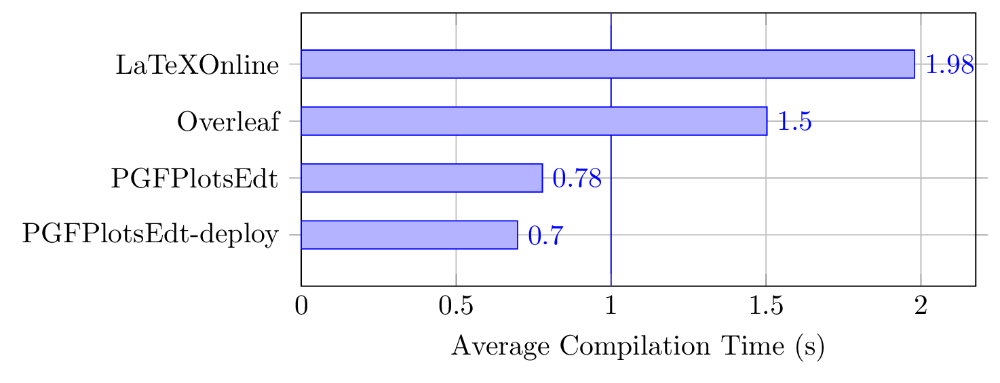

# pgfplots-benchmark
Benchmark LaTeX compilation platforms based on PGFPlots examples

## Usage

You need to run the benchmark on a Linux operating system.

### Clone all submodules

This benchmark contains some submodules, you need to clone them first.
```bash
git submodule update --init
```

### Prepare the environment

Install [Anaconda](https://www.anaconda.com/download/success) first, and prepare the environment based on the config file `pgfplots_benchmark.yml`.

```bash
conda env update -n pgfplots_benchmark -f pgfplots_benchmark.yml
conda activate pgfplots_benchmark
```

### Prepare the database

The database [latex_pgfplots_doctest](latex_pgfplots_doctest/), which is extracted from `pgfplots` documentation, should contain 728 examples with approximately 660 compilable files. 

To extract the database, you need to install [Perl](https://www.perl.org/get.html) first (or install TeX Live directly), then run the following script:

```bash
python extract_dataset.py
```

The dataset is not perfect, since the script converted every file into single standalone TeX file without any dependencies. There could be files that could not pass the compilation at all, or require LuaTeX to compile, or require `--shell-escape` option (mostly deactivated from servers).

### Benchmark

You need to start docker before running benchmarks. If your current user does not have the privilege to run `docker`, you need to switch to the root user first by `sudo -s`.

> Most of the submodules are optimized by local mirrors. Remove those mirrors if you can not initialize docker containers.

#### PGFPlotsEdt

Run the script to start the non-deployment version (since it is not a docker version, you need to install TeX Live on your host):
```bash
python ppedt_benchmark.py
```

Pass an additional argument to the script to start the deployment version:
```bash
python ppedt_benchmark.py --deploy
```

#### Overleaf

You need to start the docker container following [overleaf/services/clsi/README.md](https://github.com/overleaf/overleaf/blob/main/services/clsi/README.md) manually in a different terminal and stop it manually afterwards `docker stop clsi`.

Then you could start the benchmark by
```bash
python overleaf_benchmark.py
```

#### LaTeX Online

You need to build the docker image first by
```bash
cd latex-online && docker build -t aslushnikov/latex-online:latest .
```

Then you could run the script to start the benchmark:
```bash
python laton_benchmark.py
```

### Statistics

You could merge all the results by
```bash
python merge_result.py
```
The result will be in `merged_result_times_avg.csv` and `merged_result_times.csv`.

## Result

The following result is tested on a typical server with 4 CPU cores and 4GB RAM.



  : Average compilation time per file, only the common successful compilation files are taken into account.


  : Compilation time of every file, where files with compilation time of 0s are considered to be failed.

## License

Since most of the parts are licensed under GPL-3.0 or AGPL-3.0, this repo maintains the license of [AGPL-3.0](LICENSE).
